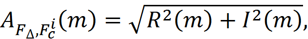
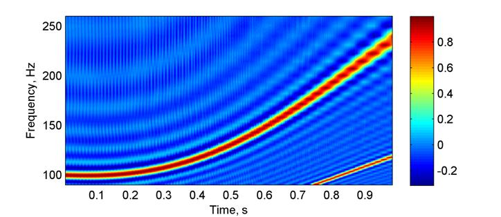
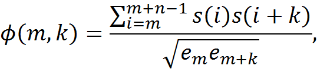
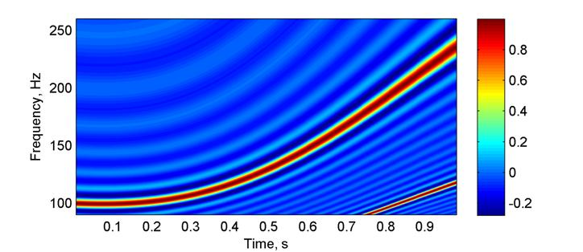
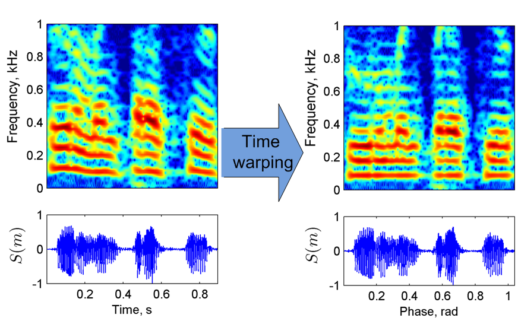
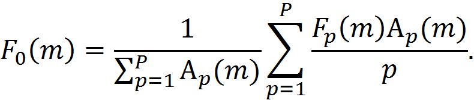
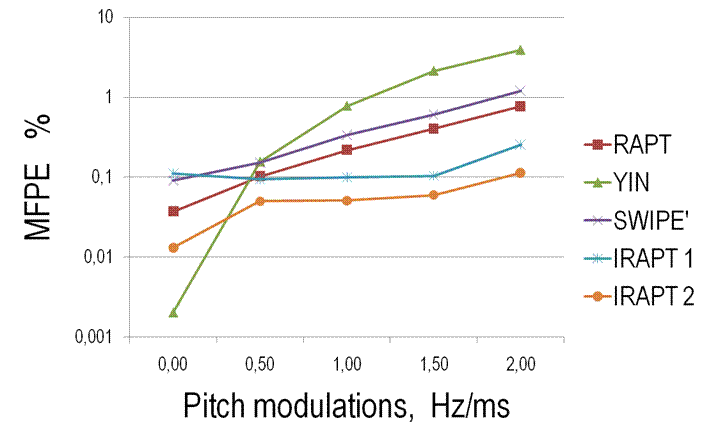

# IRAPT (Instantaneous pitch estimation based on RAPT framework)
### Abstract
This is the homepage of instantaneous RAPT (IRAPT) algorithm. It is a pitch estimation technique based on the robust algorithm for pitch tracking (RAPT) framework. IRAPT provides estimation of instantaneous pitch values and is not sensitive to rapid frequency modulations. The algorithm utilizes a different period candidate generating function based on instantaneous harmonic parameters. The function is similar to normalized cross-correlation function, however it represents momentary periodicity with high frequency resolution. The second major revision of RAPT is an additional post-processing procedure that makes estimation values more accurate. 

##### Citation
A short algorithm description is given in  

E. Azarov, M. Vashkevich. and A. Petrovsky, <a href="http://www.eurasip.org/Proceedings/Eusipco/Eusipco2012/Conference/papers/1569583175.pdf"> "Instantaneous pitch estimation based on RAPT framework"</a> Proceedings of the 20th European Signal Processing Conference (EUSIPCO'2012), pp. 2787-2791,  Bucharest, Romania, August 27-31, 2012.


```
@inproceedings{Azarov-12, 
 author={Elias Azarov and Maxim Vashkevich and Alexander A. Petrovsky}, 
 booktitle={Proc. of the 20th European Signal Processing Conference (EUSIPCO)}, 
 title={Instantaneous pitch estimation based on {RAPT} framework}, 
 year={2012}, 
 pages={2787-2791}, 	
 month={Aug}}
```

### Introduction
A pitch estimation technique  based on the robust algorithm for pitch tracking (RAPT) framework [1].
The main features of the proposed algorithm are:
<ul type="circle">
<li>estimation of instantaneous pitch;</li>
<li>accurate processing of rapid pitch, modulations;</li>
<li>high time/frequency resolution;</li>
<li>low (quasilinear) computational complexity.</li>
</ul>

The main ideas behind the algorithm are:
<ul type="circle">
<li>period candidate generation function is calculated using instantaneous harmonic parameters;</li>
<li>pitch values are recalculated in warped time domain.</li>
</ul>

### Pitch estimation scheme
The pitch estimation scheme provides two pitch estimations: initial pitch estimation (denoted as "IRAPT 1") and recalculated pitch in time warped domain 
(denoted as "IRAPT 2").


### Estimation of instantaneous harmonic parameters
The signal _s(m)_ is decomposed into overlapping bandlimited analytical signals  
: <br>
 <br>
where  - bandwidth and  - center frequency of the i-th band and  - an even window function. Then instantaneous parameters are evaluated as
<ul type="circle">
<li>amplitude </li>
<li>frequency </li>
<li>phase </li>
</ul>
where  and  are real and imaginary parts of  respectively.

### Period candidate generating function
<table border="0">
<tr>
<td>RAPT <br></td>
<td>Normalized cross-correlation function (NCCF)<br>
 <br>
where    and n - window size.
</td>
</tr>
<tr>
<td>IRAPT <br></td>
<td>NCCF is calculated using instantaneous harmonic parameters<br>
 <br>
where P is the number of bandlimited analytical signals.
</td>
</tr>
</table>

### Time warping and pitch recalculation
Time warping eliminates pitch modulations. The signal  is sampled with variable frequency aligned with estimated initial pitch contour. Resampling is carried out using sinc interpolation.


Pitch recalculation: new pitch values (denoted as "IRAPT 2" on the scheme) are calculated as:<br>



### Experimental results
The proposed technique is compared with other pitch estimation algorithms in terms of gross pitch error (GPE, %) and mean fine pitch error (MFPE, %). </p>
#### Artificial signals


#### Natural speech

<table  border=0 cellspacing=0 cellpadding=0 width=470>
  <td width=87 rowspan=2 valign=top>
  <p   align=center ><span><o:p>&nbsp;</o:p></span></p>
  </td>
  <td width=236 colspan=2 valign=top >
  <p   align=center ><span>Male<o:p></o:p></span></p>
  </td>
  <td width=253 colspan=2 valign=top >
  <p   align=center><span>Female<o:p></o:p></span></p>
  </td>
 </tr>
 <tr>
  <td width=122 valign=top >
  <p   align=center ><span>GPE<o:p></o:p></span></p>
  </td>
  <td width=114 valign=top >
  <p   align=center><span>MFPE<o:p></o:p></span></p>
  </td>
  <td width=140 valign=top>
  <p   align=center><span>GPE<o:p></o:p></span></p>
  </td>
  <td width=113 valign=top>
  <p   align=center><span>MFPE<o:p></o:p></span></p>
  </td>
 </tr>
 <tr>
  <td width=87 valign=top >
  <p align=center><span>RAPT [1]<o:p></o:p></span></p>
  </td>
  <td width=122 valign=top>
  <p align=center><span>3.69<o:p></o:p></span></p>
  </td>
  <td width=114 valign=top>
  <p align=center><span >1.74<o:p></o:p></span></p>
  </td>
  <td width=140 valign=top>
  <p   align=center><span >6.07<o:p></o:p></span></p>
  </td>
  <td width=113 valign=top>
  <p align=center><span>1.18<o:p></o:p></span></p>
  </td>
 </tr>
 <tr >
  <td width=87 valign=top>
  <p   align=center ><span >YIN [2]<o:p></o:p></span></p>
  </td>
  <td width=122 valign=top>
  <p   align=center ><span >3.18<o:p></o:p></span></p>
  </td>
  <td width=114 valign=top>
  <p   align=center ><b ><span>1.39<o:p></o:p></span></b></p>
  </td>
  <td width=140 valign=top>
  <p   align=center ><span >3.96<o:p></o:p></span></p>
  </td>
  <td width=113 valign=top>
  <p   align=center ><span >0.84<o:p></o:p></span></p>
  </td>
 </tr>
 <tr>
  <td width=87 valign=top>
  <p   align=center ><span >SWIPE'[3]<o:p></o:p></span></p>
  </td>
  <td width=122 valign=top >
  <p   align=center ><b><span>0.78<o:p></o:p></span></b></p>
  </td>
  <td width=114 valign=top>
  <p   align=center ><span>1.51<o:p></o:p></span></p>
  </td>
  <td width=140 valign=top>
  <p   align=center ><span>4.27<o:p></o:p></span></p>
  </td>
  <td width=113 valign=top>
  <p   align=center ><b><span>0.80<o:p></o:p></span></b></p>
  </td>
 </tr>
 <tr>
  <td width=87 valign=top >
  <p   align=center ><span  >IRAPT 1<o:p></o:p></span></p>
  </td>
  <td width=122 valign=top>
  <p   align=center ><span  >1.63<o:p></o:p></span></p>
  </td>
  <td width=114 valign=top>
  <p   align=center ><span>1.61<o:p></o:p></span></p>
  </td>
  <td width=140 valign=top>
  <p   align=center><b><span>3.78<o:p></o:p></span></b></p>
  </td>
  <td width=113 valign=top>
  <p   align=center ><span >0.98<o:p></o:p></span></p>
  </td>
 </tr>
 <tr >
  <td width=87 valign=top >
  <p  align=center ><span>IRAPT 2<o:p></o:p></span></p>
  </td>
  <td width=122 valign=top>
  <p align=center ><span>1.57<o:p></o:p></span></p>
  </td>
  <td width=114 valign=top>
  <p  align=center ><span>1.57<o:p></o:p></span></p>
  </td>
  <td width=140 valign=top>
  <p align=center><span>3.78<o:p></o:p></span></b></p>
  </td>
  <td width=113 valign=top >
  <p align=center><span>1.05<o:p></o:p></span></p>
  </td>
 </tr>
</table>

### Conclusions
<p>An instantaneous pitch estimation algorithm has been proposed. The algorithm has low sensitivity to rapid pitch modulations and provides accurate values with high time/frequency resolution. Due to its properties the algorithm can be useful in various applications such as speech analysis/synthesis and automatic rotational frequency tracking for mechanical devices. </p>

### Reference
<p>[1] D. Talkin, "A Robust Algorithm for Pitch Tracking (RAPT)" in "Speech Coding & Synthesis", W B Kleijn, K K Paliwal eds, Elsevier ISBN 0444821694, 1995. </p>
<p>[2] A. Cheveigne and H. Kawahara "YIN, a fundamental frequency estimator for speech and music", Journal Acoust. Soc. Am., vol. 111, no. 4, pp 1917-1930, Apr. 2002.</p>
<p>[3] A. Camacho and J. G. Harris, "A sawtooth waveform  inspired pitch estimator for speech and music",  Journal Acoust. Soc. Am., vol. 123, no. 4, pp 1638-1652, Sep. 2008.</p>